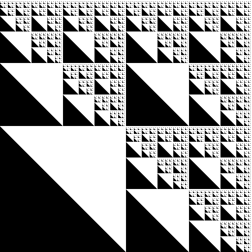

# Gerando fractais com uma Máquina de Mealy

*Nota: Se estiver à procura de uma explicação formal do desenvolvimento e funcionamento do projeto, acesse o [Relatório formal em PDF](https://github.com/LucianoKohler/Trabalho_LFA_MaquinaDeMealy/blob/main/Relat%C3%B3rio%20Fractais%20via%20M%C3%A1quina%20de%20Mealy.pdf)*

---

### Apresentação do Projeto

Este repositório representa um trabalho da matéria de **LFA** (Linguagens Formais e Autômatos), onde, à partir de máquinas de uma **palavra** que representa [plano cartesiano setorizado](https://en.wikipedia.org/wiki/Quadtree) e uma [máquina de Mealy](https://en.wikipedia.org/wiki/Mealy_machine) que representa uma [expressão regular](https://pt.wikipedia.org/wiki/Express%C3%A3o_regular), é gerado um **fractal** de tamanho condizente com o tamanho da palavra recebida

Para o trabalho, foram recebidas três expressões regulares por parte da professora orientadora, cada uma com uma lógica distinta que gera uma saída distinta.

### Expressões Recebidas
* (1+2+4)\*3(2+4)\*3(1+2+3+4)\*
* (12+14+32+34+21+23+41+43)\*
* (1+3)\*(2+4)\*

### Fractais Correspondentes:

Cada fractal representa a visualização das expressões acima, respectivamente:

  
  
  

---

### Autores do projeto

Este experimento existe graças a:

  
  ㅤ
  

<strong>Luciano Kohler da Silva e Luiza Mannes Silveira e a grandessíssima professora Karina Girardi Roggia ✨</strong>

